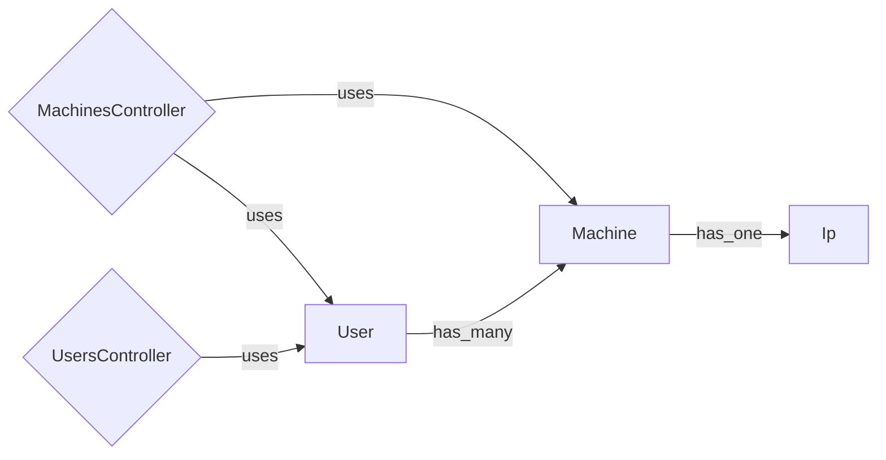

```mermaid
graph LR
MachinesController{MachinesController} -->|uses| User[User]
MachinesController{MachinesController} -->|uses| Machine[Machine]
UsersController{UsersController} -->|uses| User[User]
Machine[Machine] -->|has_one| Ip[Ip]
User[User] -->|has_many| Machine[Machine]
```